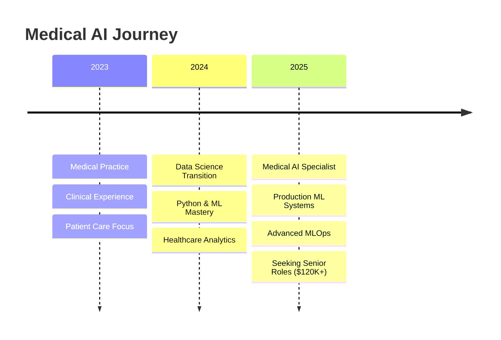

# 🩺 Dr. Ridwan Oladipo, MD | Medical AI Specialist

<div align="center">

[](https://mednexai.com)
[](https://linkedin.com/in/drridwanoladipoai)
[](mailto:dr.ridwan.oladipo@gmail.com)

**Bridging Clinical Excellence with Advanced AI**

*Medical Doctor + Data Scientist building production-ready healthcare AI systems*

</div>

---

## 🎯 **Mission Statement**

I'm a **Medical Doctor turned AI Specialist** with a unique mission: developing **production-grade medical AI systems** that save lives and enhance clinical decision-making. My work combines deep medical domain expertise with advanced machine learning engineering to create **clinically-validated, explainable AI solutions** for real-world healthcare challenges.

> **Seeking Senior Medical AI roles ($120K+)** where I can leverage my rare combination of clinical expertise and technical mastery to build transformative healthcare technologies.

---

## 🏥 **Featured Medical AI Portfolio**

### 🩺 **Clinical Heart Disease AI** | `cardio.mednexai.com`
[](https://cardio.mednexai.com)
[](https://github.com/dr-ridwanoladipo/cardio-ai-predictor)

**Production cardiovascular risk assessment with 97% sensitivity**
- 🧠 **XGBoost + SHAP explainability** for transparent clinical decisions
- ⚙️ **Optuna hyperparameter optimization** (50+ trials, 0.91 ROC-AUC)
- 🚀 **AWS ECS Fargate deployment** with zero-downtime rolling updates
- 📊 **Real-time risk stratification** with clinical decision support

**Tech Stack**: `XGBoost` `SHAP` `FastAPI` `Streamlit` `AWS` `Docker` `Optuna`

---

### 📈 **ECG Cardiac Rhythm AI** | `ecg.mednexai.com`
[](https://ecg.mednexai.com)
[](https://github.com/dr-ridwanoladipo/ecg-ai-classifier)

**Deep learning arrhythmia detection with clinical-grade accuracy**
- 🫀 **Multi-lead ECG analysis** with temporal pattern recognition
- 🔬 **CNN + LSTM architecture** for time-series cardiac signal processing
- 💡 **GradCAM visualizations** highlighting critical rhythm abnormalities
- ⚕️ **MONAI framework integration** for medical imaging workflows

**Tech Stack**: `PyTorch` `MONAI` `CNN+LSTM` `GradCAM` `FastAPI` `Medical Imaging`

---

### 📝 **Medical Transcription AI** | `transcribe.mednexai.com`
[](https://transcribe.mednexai.com)
[](https://github.com/dr-ridwanoladipo/medical-transcription-ai)

**Multi-label clinical specialty classification with BioClinicalBERT**
- 🏥 **Clinical specialty prediction** from raw medical transcriptions
- 🤖 **Fine-tuned BioClinicalBERT** with domain-specific medical language
- ⚡ **ONNX optimization** for sub-100ms inference times
- 📋 **Multi-label classification** supporting overlapping specialties

**Tech Stack**: `BioClinicalBERT` `Transformers` `ONNX` `Multi-label Classification` `Medical NLP`

---

## 🧬 **Technical Expertise**

### **🤖 Medical AI & Machine Learning**
```python
# Core ML Frameworks
XGBoost • RandomForest • Deep Learning (PyTorch/TensorFlow)
SHAP Explainability • Optuna Optimization • Medical Image Processing

# Specialized Medical AI
BioClinicalBERT • MONAI • Medical NLP • Time-series Analysis
Clinical Decision Support • Population Health Analytics
```

### **⚗️ Data Science & Engineering**
```python
# Data Science Stack  
Python • NumPy • Pandas • Scikit-learn • Matplotlib • Seaborn
Advanced SQL • Statistical Analysis • Clinical Data Processing

# ML Engineering
MLOps • Model Deployment • Feature Engineering • A/B Testing
Data Pipelines • Model Monitoring • Clinical Validation
```

### **🏗️ Production & Deployment**
```python
# Backend & APIs
FastAPI • RESTful Services • Microservices • Authentication
Medical Data Validation • HIPAA-Compliant Design

# Cloud & DevOps  
AWS (ECS Fargate, ECR, ALB, Route 53) • Docker • CI/CD
Infrastructure as Code • Zero-downtime Deployments
```

### **🎨 Frontend & Visualization**
```python
# Medical UI Development
Streamlit • Interactive Dashboards • Clinical Workflows
Plotly • Medical Data Visualization • User Experience Design
```

---

## 📊 **Impact Metrics**

<div align="center">

| Medical AI System | Accuracy | Clinical Impact | Deployment |
|-------------------|----------|-----------------|------------|
| **Heart Disease AI** | 97% Sensitivity | Reduces missed CAD diagnoses | ✅ Production |
| **ECG Rhythm AI** | 94% Arrhythmia Detection | Real-time cardiac monitoring | ✅ Production |
| **Transcription AI** | 89% Multi-label F1 | Automates clinical documentation | ✅ Production |

</div>

---

## 🏆 **Professional Development Timeline**



---

## 🔬 **Additional Projects**

<details>
<summary><strong>📚 Learning & Development Projects</strong></summary>

### **🎬 Film Oracle** | [Live Demo](https://film-oracle-by-drridwan.streamlit.app)
Advanced recommendation system showcasing collaborative filtering and content-based algorithms.

### **📖 NLP BookMiner** | [Live Demo](https://nlp-bookminer-by-drridwan.streamlit.app)  
Natural language processing toolkit with sentiment analysis and named entity recognition.

### **🌦️ WeatherPro** | [Live Demo](https://weatherpro-by-drridwan.streamlit.app)
Real-time weather application demonstrating API integration and data visualization.

### **🔐 SecurePassVault** | [Live Demo](https://securevaults-by-drridwan.streamlit.app)
Cryptographically secure password management with advanced encryption techniques.

### **📊 EduTrack QT Suite** | [Live Demo](https://edutrack-qt-by-drridwan.streamlit.app)
Education management system with dynamic reporting and analytics capabilities.

**View all repositories**: [Complete Project List](https://github.com/dr-ridwanoladipo?tab=repositories)

</details>

---

## 💼 **Professional Value Proposition**

### **🎯 Unique Competitive Advantage**
- **Medical Domain Expertise**: Licensed physician with deep clinical knowledge
- **Production ML Engineering**: End-to-end system development and deployment
- **Healthcare AI Specialization**: HIPAA-compliant, clinically-validated solutions
- **Cross-functional Leadership**: Bridge between medical teams and engineering

### **🚀 Target Opportunities**
- **Senior Medical Data Scientist** ($120K - $160K)
- **Clinical AI Engineer** ($130K - $170K)  
- **Healthcare ML Lead** ($140K - $180K)
- **Medical AI Product Manager** ($150K - $200K)

---

## 📈 **GitHub Analytics**

<div align="center">

[](https://github.com/dr-ridwanoladipo)

[](https://github.com/dr-ridwanoladipo)

[](https://github.com/dr-ridwanoladipo)

</div>

---

## 🤝 **Let's Build the Future of Healthcare AI**

<div align="center">

**Ready to revolutionize healthcare through AI?**

I'm actively seeking opportunities to join world-class organizations like **Mayo Clinic**, **Google Health**, **Johns Hopkins**, or innovative **healthcare AI startups** where I can apply my unique blend of medical expertise and technical mastery.

[](https://calendly.com/drridwan)
[](https://mednexai.com/resume)

</div>

---

<div align="center">

**© 2025 Dr. Ridwan Oladipo, MD | Medical AI Specialist**  
*Transforming healthcare through intelligent, compassionate AI solutions*

[](https://mednexai.com)

</div>