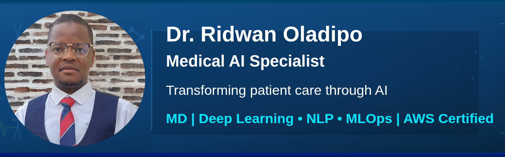
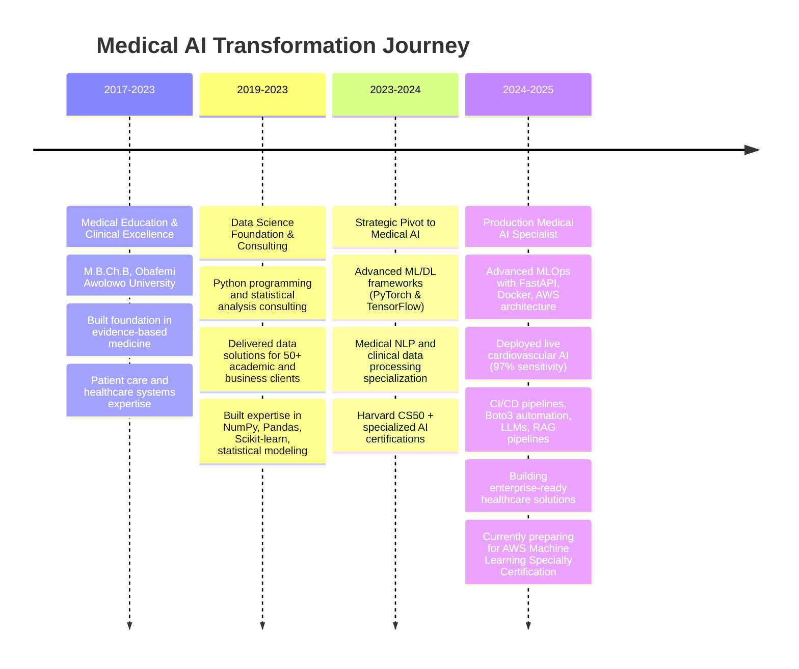

<div align="center">

[](https://mednexai.com)
&nbsp;&nbsp;
[](https://linkedin.com/in/drridwanoladipoai)
&nbsp;&nbsp;
[](mailto:dr.ridwan.oladipo@gmail.com)

**Bridging Clinical Excellence with Advanced AI**

*Medical Doctor + Data Scientist building production-ready healthcare AI systems*

</div>

---

## 🎯 **Mission Statement**

As a **Medical Doctor** with **rigorous clinical training** and **deep specialization in AI and machine learning**, I'm dedicated to building **production-grade medical AI systems** that transform **clinical decision-making**. My unique blend of **medical expertise** and **advanced technical skills** enables me to develop **clinically-informed, explainable AI solutions** that tackle **real-world healthcare challenges at scale**, with **proven success in deploying systems that exceed clinical thresholds for FDA-regulated environments**.

> **Seeking Senior Medical AI roles** where I can leverage my rare combination of clinical expertise and technical mastery to build transformative healthcare technologies.
---

## 🏥 **Featured Medical AI Portfolio**

### 🩺 **Clinical Heart Disease AI** | `cardio.mednexai.com`
[](https://cardio.mednexai.com)
&nbsp;&nbsp;
[](https://github.com/dr-ridwanoladipo/cardio-ai-predictor)

**97% sensitivity in production cardiovascular risk assessment**
- 🧠 **XGBoost + SHAP explainability** for transparent, trusted predictions
- ⚙️ **Optuna optimization** (50+ trials, 0.91 ROC-AUC) for clinical-grade performance
- 🚀 **Deployed on AWS ECS Fargate** with zero-downtime rolling updates
- 📊 **Real-time risk stratification** + guideline-based decision support

**Tech Stack**: `XGBoost` `SHAP` `FastAPI` `Streamlit` `AWS` `Docker` `Optuna`

---

### 🫀 **ECG Cardiac AI** | `ecg.mednexai.com`  (On-demand)
[](mailto:dr.ridwan.oladipo@gmail.com)

**Multimodal ResNet-1D ECG classifier with clinical-grade performance**  
- 🧠 **ResNet-1D + tabular fusion** for 12-lead ECG & patient data  
- 🎯 **96% MI sensitivity, 99.9% MI specificity**, AUC: 0.94, Kappa: 0.81  
- 💡 **Explainability with GradCAM + SHAP** for diagnostic transparency  
- ☁️ **AWS-ready architecture** with FastAPI, Streamlit, and Docker

**Tech Stack**: `PyTorch` `ResNet-1D` `Multimodal Fusion` `GradCAM` `SHAP` `FastAPI` `Streamlit` `Docker` `AWS ECS`

---

### 🧠 **Complex MRI Brain Tumor Segmentation** | `brain-tumor-ai.mednexai.com` (On-demand)
[](mailto:dr.ridwan.oladipo@gmail.com)

**Multi-site 4D MRI analysis with nnUNet architecture achieving 84% whole tumor Dice**
- 🧠 **~750 4D volumes** processed across heterogeneous clinical sites
- 🎯 **84% whole tumor Dice score** exceeding clinical thresholds for surgical planning
- ⚙️ **Multi-modal fusion** of FLAIR, T1w, T1Gd, T2w sequences
- 🔬 **Self-supervised pre-training** with masked autoencoders for robust generalization
- 📊 **BraTS-standard evaluation** with comprehensive clinical metrics

**Tech Stack**: `PyTorch` `MONAI` `nnUNet` `3D Attention U-Net` `Self-Supervised Learning` `DICOM Processing`

---

### 📝 **Medical Transcription AI** | `transcribe.mednexai.com` (On-demand)
[](mailto:dr.ridwan.oladipo@gmail.com)

**Multi-label clinical specialty classification with BioClinicalBERT**
- 🏥 **Clinical specialty prediction** from raw medical transcriptions
- 🤖 **Fine-tuned BioClinicalBERT** with domain-specific medical language
- ⚡ **ONNX optimization** for sub-100ms inference times
- 📋 **Multi-label classification** supporting overlapping specialties

**Tech Stack**: `BioClinicalBERT` `Transformers` `ONNX` `Multi-label Classification` `Medical NLP`

---

## 🧬 **Technical Expertise**

### **🤖 Medical AI & Machine Learning**
```python
# Core ML Frameworks
XGBoost • RandomForest • LogisticRegression • Deep Learning (PyTorch/TensorFlow)
SHAP • GradCAM Explainability • Optuna Optimization • Medical Image Processing
NLP (BioClinicalBERT) • LLMs • RAG Pipelines • AI API Integrations (OpenAI, HuggingFace)

# Specialized Medical AI
MONAI  • nnUNet • Medical NLP • Time-series Analysis • Clinical Decision Support
Population Health Analytics • Medical Knowledge GraphsAnalytics
```

### **⚗️ Data Science & Engineering**
```python
# Data Science Stack  
Python • NumPy • Pandas • Scikit-learn • Matplotlib • Seaborn
Advanced SQL • PostgreSQL • Statistical Analysis • Clinical Data Processing

# ML Engineering
MLOps • Model Deployment • Feature Engineering • A/B Testing
Data Pipelines • Model Monitoring • Clinical Validation
```

### **🏗️ Production & Deployment**
```python
# Backend & APIs
FastAPI • RESTful Services • Microservices • Authentication
Medical Data Validation • HIPAA-Compliant Design • API Testing

# Cloud & DevOps  
AWS (ECS Fargate, ECR, ALB, Route 53, EC2, Lambda) • Docker • CI/CD
Auto-scaling (CPU/Memory/Custom Metrics) • EventBridge Scheduling
Automated Deployments • Zero-downtime Deployments • Boto3 Automation
```

### **🎨 Frontend & Visualization**
```python
# Medical UI Development
Streamlit • Interactive Dashboards • Clinical Workflows
Plotly • Medical Data Visualization • User Experience Design
```

---

## 📊 **Impact Metrics**

<div align="center">

| System               | Accuracy / Metric         | Impact                            | Deployment       |
|----------------------|---------------------------|-----------------------------------|------------------|
| 🩺 **Heart Disease AI** | ✅ 97% Sensitivity        | 🔬 Reduces missed CAD cases       | 🚀 Live           |
| 🫀 **ECG Rhythm AI**    | ✅ 96% MI Sensitivity      | ⚕️ Clinical-grade cardiac diagnosis | 🚀 On-demand    |
| 🧠 **Brain Tumor AI**   | ✅ 84% Whole Tumor Dice   | 🏥 Enables surgical planning      | 🚀 On-demand     |
| 📝 **Transcription AI** | ✅ 89% Multi-label F1     | 📋 Automates specialty routing    | 🚀 On-demand     |

</div>


---

## 🏆 **Professional Development Timeline**


---

## 💼 **Professional Value Proposition**

### **🎯 Unique Competitive Advantage**
- **Medical Domain Expertise:** MD with rigorous clinical training and deep understanding of healthcare systems.
- **Production ML Engineering:** Architected end-to-end systems with robust deployment, monitoring, and scaling.
- **Healthcare AI Specialization:** Built HIPAA-conscious, clinically-informed AI systems with robust explainability for real-world care.
- **Cross-functional Leadership:** Bridge medical teams and engineering orgs to drive impactful solutions.

### **🚀 Target Opportunities**
- **Senior Medical Data Scientist**
- **Clinical AI Engineer**  
- **Healthcare ML Lead**
- **Medical AI Product Manager**
---

## 🤝 **Let's Build the Future of Healthcare AI**

<div align="center">

**Ready to revolutionize healthcare through AI?**

I'm actively seeking opportunities to join **world-class healthcare organizations** and **innovative medical AI companies** where I can apply my unique blend of medical expertise and technical mastery to build transformative, life-saving technologies.

</div>

---

<div align="center">

**© 2025 Dr. Ridwan Oladipo, MD | Medical AI Specialist**  
*Transforming healthcare through intelligent, compassionate AI solutions*

</div>