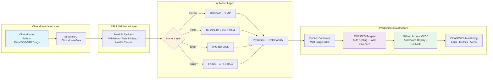

# **Ridwan Oladipo, MD**

### Medical Data Scientist • Clinical AI Architect • MLOps Engineer

*Building end-to-end medical AI — **7+ production deployments** (neurosurgery, cardiology, radiology, pharmacology) on **AWS** with **<200ms inference** and **full CI/CD automation***

**Deep Learning • RAG • LLMs • MLOps • Explainable AI (SHAP/Grad-CAM)**

**Stanford • Harvard • Duke • Oxford • Johns Hopkins**

---

---

## 🎯 Executive Overview

MD delivering **production-grade clinical AI systems** across **cardiology, ECG diagnostics, neurosurgery, radiology (MRI), and pharmacology** — achieving **97% cardiovascular sensitivity**, **96% MI detection**, **86% tumor-segmentation Dice in 5.8s**, and **170K+ RAG-powered drug-interaction coverage** at **<200ms latency**.

Each solution unifies **deep learning, RAG, and LLMs** with **SHAP/Grad-CAM explainability**, **FastAPI backends**, and **AWS Fargate CI/CD** for clinically safe, enterprise-ready deployment.

---

## 🚀 Flagship Projects

### 🌐 Deployment Options
- **Live Demos:** Instant access via HuggingFace (UI + API)  
- **Production (On-Demand):** Fully deployed on AWS ECS Fargate — available by request  
> ⚡ **AWS Production:** CI/CD-enabled with <10 minutes cold-start (cost-optimized)

---

### 🩺 **Heart Disease Risk AI**
**Problem:** Heart disease causes 17.9 million deaths worldwide annually; manual ASCVD scoring delays emergency triage  
**Performance:** **97% sensitivity** · **0.91 AUC** · **<200ms inference** · **SHAP explainability**  
**Deployment:** XGBoost + FastAPI + Streamlit → AWS Fargate CI/CD  

  
    

---

### 🫀 **Clinical-Grade ECG Diagnosis AI**
**Problem:** Delayed ECG interpretation increases MI mortality; limited cardiologist availability creates critical bottlenecks in emergency workflows  
**Performance:** **96.2% MI sensitivity** · **99.9% specificity** · **0.9986 AUC** · **Grad-CAM + SHAP**  
**Deployment:** ResNet-1D + TensorFlow → FastAPI → AWS Fargate with zero-downtime rollback  

  
  

---

### 🧠 **Brain Tumor Segmentation AI**
**Problem:** Manual MRI tumor segmentation takes 25–45 minutes per case, delaying critical neurosurgical decisions   
**Performance:** **86% Whole-Tumor Dice** · **5.8s inference** · **nnU-Net 2025** · **Robustness-tested**  
**Deployment:** PyTorch + SageMaker training → FastAPI + Streamlit → AWS Fargate with PACS-ready DICOM workflow  

  
  

---

### 💊 **Drug Interaction AI**
**Problem:** 1.3M+ annual U.S. ER visits from adverse drug events; pharmacist reviews take 15–20 min  
**Performance:** **170K+ DrugBank interactions** · **<200ms KB lookup** · **GPT-5 RAG + FAISS semantic retrieval** · **89.8% RxNorm normalization**  
**Deployment:** Tier-adaptive retrieval (direct KB → FAISS → GPT-5) → FastAPI rate-limited endpoints → AWS Fargate  

 
  
  

---

## 🏗️ Unified Technical Architecture

**All systems follow a consistent production pattern** — demonstrating repeatable MLOps engineering across deep learning, classical ML, and LLM-based retrieval:

**Stack Consistency Across All Projects:**  
✅ **Frontend:** Streamlit clinical UI with domain-specific visualizations  
✅ **Backend:** FastAPI with Pydantic validation, rate limiting (SlowAPI), Swagger docs  
✅ **Deployment:** Docker multi-stage builds → AWS ECS Fargate → Application Load Balancer  
✅ **CI/CD:** GitHub Actions automated pipelines (~5 min git push → production)  
✅ **Monitoring:** CloudWatch logs, health checks, automated rollback on failure  
✅ **Explainability:** SHAP (tabular), Grad-CAM (imaging), tier-stamped confidence (RAG)

---

## 📈 Clinical Impact Summary

| Project | Clinical Value | Business ROI | Enterprise Readiness |
|---------|----------------|--------------|---------------------|
| **Heart Disease Risk AI** | Automates ASCVD/Framingham scoring · Identifies high-risk patients before acute events · Reduces avoidable ED admissions | **8,000+ physician-hours saved annually** (500-bed hospital) · Preventive care cost avoidance | **EHR-ready API** · Epic/Cerner integration · <200ms real-time response |
| **ECG Diagnosis AI** | Accelerates MI triage · Standardizes interpretation in rural/understaffed settings · Reduces door-to-balloon time | **$1.3M+ annual litigation risk prevented** per hospital · Fewer missed diagnoses | **PACS-compatible** · Zero false-negative tolerance · Multi-site PTB-XL validation |
| **Brain Tumor Segmentation AI** | Cuts segmentation time from 25–45 min → **5.8 seconds** (99% faster) · Surgical-grade boundary precision for resection planning | **Radiologist bottleneck elimination** · Faster treatment decisions · Radiotherapy workflow acceleration | **DICOM-native** · PACS integration · nnU-Net clinical-grade standard |
| **Drug Interaction AI** | Automates 15–20 min pharmacist reviews · Real-time polypharmacy risk synthesis · Catches brand-name mismatches (89.8% RxNorm success) | **8,000+ hours saved annually** · **$50K+ per ADE prevented** (litigation + LOS) | **Epic/Cerner CPOE pluggable** · <200ms Tier-1 lookup · FDA SaMD-aligned safety logic |

___

## 🔬 Modeling & Explainability Suite

- **Modeling:** XGBoost (tabular cardiology), ResNet-1D (ECG waveforms), nnU-Net 2025 (MRI), RAG + GPT-5 (pharmacology)  
- **Explainability:** SHAP (tabular), Grad-CAM (ECG), 3D segmentation overlays (MRI), tiered evidence reasoning (RAG)  
- **Outcome:** Clinically transparent, auditable AI aligned with FDA SaMD expectations — never black-box models

---

## 🛡️ Safety, Compliance & Validation

- **Regulatory alignment:** Built under **FDA SaMD principles** with stratified splits and robustness checks (noise, intensity shifts, demographic subgroups)  
- **Clinical safeguards:** All deployments include medical disclaimers — AI assists clinicians, never replaces judgment  
- **Operational safety:** Tiered confidence logic (Drug AI), clinical plausibility checks (Cardio), high-sensitivity prioritization (ECG/Brain)

---

## 🛠️ Tech Stack

**Deep Learning & ML**  

**LLMs & Retrieval**  

**MLOps & Deployment**  

**Frontend & Explainability**  

**Clinical Data & Standards**  

---

## 🎓 Professional Training

**Stanford University** — AI in Healthcare Specialization (5 courses)  
**University of Oxford** — Generative and Agentic AI  
**Harvard University** — CS50x: Introduction to Computer Science  
**Harvard University** — Machine Learning and AI with Python  
**Duke University** — MLOps: Machine Learning Operations Specialization (4 courses)  
**Johns Hopkins University** — Generative AI in Public Health

---

## 🤝 Collaboration & Contact

**Open to:** Medical Data Scientist · Clinical AI Architect · Applied ML/MLOps Engineer  
**Collaboration:** Hospitals, AI startups, research labs, telemedicine companies, and engineering teams building real-world medical AI products

---
