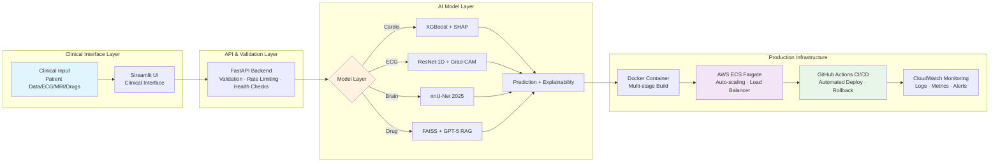

# **Ridwan Oladipo, MD**

### Medical Data Scientist • Clinical AI Architect • MLOps Engineer

*Building end-to-end medical AI — **7+ production deployments** (neurosurgery, cardiology, radiology, pharmacology) on **AWS** with **<200ms inference** and **full CI/CD automation***

**Deep Learning • RAG • LLMs • MLOps • Explainable AI (SHAP/Grad-CAM)**

**Stanford • Harvard • Duke • Oxford • Johns Hopkins**

---

---

## 🎯 Executive Overview

MD delivering **production-grade clinical AI systems** across **cardiology, ECG diagnostics, neurosurgery, radiology (MRI), and pharmacology** — achieving **97% cardiovascular sensitivity**, **96% MI detection**, **86% tumor-segmentation Dice in 5.8s**, and **170K+ RAG-powered drug-interaction coverage** at **<200ms latency**.

Each solution unifies **deep learning, RAG, and LLMs** with **SHAP/Grad-CAM explainability**, **FastAPI backends**, and **AWS Fargate CI/CD** for clinically safe, enterprise-ready deployment.

---

## 🚀 Flagship Projects

---

### 🩺 **Heart Disease Risk AI**
**Problem:** Heart disease causes 17.9 million deaths worldwide annually; manual ASCVD scoring delays emergency triage  
**Performance:** **97% sensitivity** · **0.91 AUC** · **<200ms inference** · **SHAP explainability**  
**Deployment:** XGBoost + FastAPI + Streamlit → AWS Fargate CI/CD  

  
    

---

### 🫀 **Clinical-Grade ECG Diagnosis AI**
**Problem:** Delayed ECG interpretation increases MI mortality; limited cardiologist availability creates critical bottlenecks in emergency workflows  
**Performance:** **96.2% MI sensitivity** · **99.9% specificity** · **0.999 AUC** · **Grad-CAM + SHAP**  
**Deployment:** ResNet-1D + TensorFlow → FastAPI → AWS Fargate with zero-downtime rollback  

  
  

---

### 🧠 **Brain Tumor Segmentation AI**
**Problem:** Manual MRI tumor segmentation takes 25–45 minutes per case, delaying critical neurosurgical decisions   
**Performance:** **86% Whole-Tumor Dice** · **5.8s inference** · **nnU-Net 2025** · **Robustness-tested**  
**Deployment:** PyTorch + SageMaker training → FastAPI + Streamlit → AWS Fargate with PACS-ready DICOM workflow  

  
  

---

### 💊 **Drug Interaction AI**
**Problem:** 1.3M+ annual U.S. ER visits from adverse drug events; pharmacist reviews take 15–20 min  
**Performance:** **170K+ DrugBank interactions** · **<200ms KB lookup** · **GPT-5 RAG + FAISS semantic retrieval** · **89.8% RxNorm normalization**  
**Deployment:** Tier-adaptive retrieval (direct KB → FAISS → GPT-5) → FastAPI rate-limited endpoints → AWS Fargate  

 
  
  

---

## 🏗️ Unified Technical Architecture

**All systems follow a consistent production pattern** — demonstrating repeatable MLOps engineering across deep learning, classical ML, and LLM-based retrieval:

**Stack Consistency Across All Projects:**  
✅ **Frontend:** Streamlit clinical UI with domain-specific visualizations  
✅ **Backend:** FastAPI with Pydantic validation, rate limiting (SlowAPI), Swagger docs  
✅ **Deployment:** Docker multi-stage builds → AWS ECS Fargate → Application Load Balancer  
✅ **CI/CD:** GitHub Actions automated pipelines (~5 min git push → production)  
✅ **Monitoring:** CloudWatch logs, health checks, automated rollback on failure  
✅ **Explainability:** SHAP (tabular), Grad-CAM (imaging), tier-stamped confidence (RAG)

---