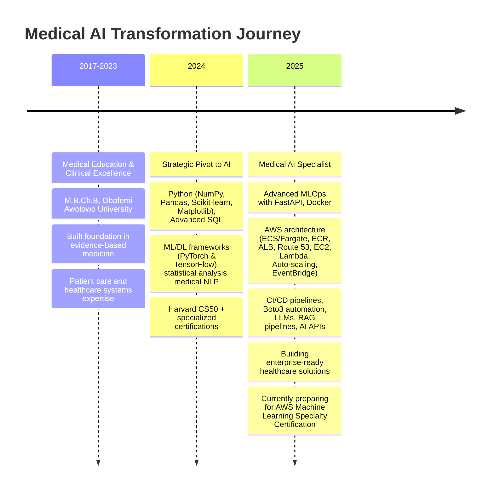

<div align="center">

[](https://mednexai.com)
&nbsp;&nbsp;
[](https://linkedin.com/in/drridwanoladipoai)
&nbsp;&nbsp;
[](mailto:dr.ridwan.oladipo@gmail.com)

**Bridging Clinical Excellence with Advanced AI**

*Medical Doctor + Data Scientist building production-ready healthcare AI systems*

</div>

---

## 🎯 **Mission Statement**

As a **Medical Doctor** with **rigorous clinical training** and **deep specialization in AI and machine learning**, I'm dedicated to building **production-grade medical AI systems** that transform **clinical decision-making**. My unique blend of **medical expertise** and **advanced technical skills** enables me to develop **clinically-informed, explainable AI solutions** that tackle **real-world healthcare challenges at scale**.

> **Seeking Senior Medical AI roles** where I can leverage my rare combination of clinical expertise and technical mastery to build transformative healthcare technologies.

---

## 🏥 **Featured Medical AI Portfolio**

### 🩺 **Clinical Heart Disease AI** | `cardio.mednexai.com`
[](https://cardio.mednexai.com)
&nbsp;&nbsp;
[](https://github.com/dr-ridwanoladipo/cardio-ai-predictor)

**97% sensitivity in production cardiovascular risk assessment**
- 🧠 **XGBoost + SHAP explainability** for transparent, trusted predictions
- ⚙️ **Optuna optimization** (50+ trials, 0.91 ROC-AUC) for clinical-grade performance
- 🚀 **Deployed on AWS ECS Fargate** with zero-downtime rolling updates
- 📊 **Real-time risk stratification** + guideline-based decision support

**Tech Stack**: `XGBoost` `SHAP` `FastAPI` `Streamlit` `AWS` `Docker` `Optuna`

---

### 📈 **ECG Cardiac Rhythm AI** | `ecg.mednexai.com`
[](https://github.com/dr-ridwanoladipo)

**Deep learning arrhythmia detection with clinical-grade accuracy**
- 🫀 **Multi-lead ECG analysis** with temporal pattern recognition
- 🔬 **CNN + LSTM architecture** for time-series cardiac signal processing
- 💡 **GradCAM visualizations** highlighting critical rhythm abnormalities
- ⚕️ **MONAI framework integration** for medical imaging workflows

**Tech Stack**: `PyTorch` `MONAI` `CNN+LSTM` `GradCAM` `FastAPI` `Medical Imaging`

---

### 📝 **Medical Transcription AI** | `transcribe.mednexai.com`
[](https://github.com/dr-ridwanoladipo)

**Multi-label clinical specialty classification with BioClinicalBERT**
- 🏥 **Clinical specialty prediction** from raw medical transcriptions
- 🤖 **Fine-tuned BioClinicalBERT** with domain-specific medical language
- ⚡ **ONNX optimization** for sub-100ms inference times
- 📋 **Multi-label classification** supporting overlapping specialties

**Tech Stack**: `BioClinicalBERT` `Transformers` `ONNX` `Multi-label Classification` `Medical NLP`

---

## 🧬 **Technical Expertise**

### **🤖 Medical AI & Machine Learning**
```python
# Core ML Frameworks
XGBoost • RandomForest • LogisticRegression • Deep Learning (PyTorch/TensorFlow)
SHAP • GradCAM Explainability • Optuna Optimization • Medical Image Processing
NLP (BioClinicalBERT) • LLMs • RAG Pipelines • AI API Integrations (OpenAI, HuggingFace)

# Specialized Medical AI
MONAI • Medical NLP • Time-series Analysis • Clinical Decision Support
Population Health Analytics • Medical Knowledge GraphsAnalytics
```

### **⚗️ Data Science & Engineering**
```python
# Data Science Stack  
Python • NumPy • Pandas • Scikit-learn • Matplotlib • Seaborn
Advanced SQL • PostgreSQL • Statistical Analysis • Clinical Data Processing

# ML Engineering
MLOps • Model Deployment • Feature Engineering • A/B Testing
Data Pipelines • Model Monitoring • Clinical Validation
```

### **🏗️ Production & Deployment**
```python
# Backend & APIs
FastAPI • RESTful Services • Microservices • Authentication
Medical Data Validation • HIPAA-Compliant Design • API Testing

# Cloud & DevOps  
AWS (ECS Fargate, ECR, ALB, Route 53, EC2, Lambda) • Docker • CI/CD
Auto-scaling (CPU/Memory/Custom Metrics) • EventBridge Scheduling
Automated Deployments • Zero-downtime Deployments • Boto3 Automation
```

### **🎨 Frontend & Visualization**
```python
# Medical UI Development
Streamlit • Interactive Dashboards • Clinical Workflows
Plotly • Medical Data Visualization • User Experience Design
```

---

## 📊 **Impact Metrics**

<div align="center">

| System              |Accuracy               |Impact                        |Deployment |
|-----------------------|-----------------------|--------------------------------|-------------|
| 🩺 **Heart Disease AI** | ✅ 97% Sensitivity     | 🔬 Reduces missed CAD cases    | 🚀 Live     |
| 🫀 **ECG Rhythm AI**   | ✅ 94% Arrhythmia Detect | ⚕️ Real-time cardiac screening | ⏳ Coming Soon     |
| 📝 **Transcription AI** | ✅ 89% Multi-label F1  | 📋 Automates clinical workflow | ⏳ Coming Soon     |

</div>


---

## 🏆 **Professional Development Timeline**



---

## 🔬 **Additional Projects**

<details>
<summary><strong>📚 Learning & Development Projects</strong></summary>

### **🎬 Film Oracle** | [Live Demo](https://film-oracle-by-drridwan.streamlit.app)
Advanced recommendation system showcasing collaborative filtering and content-based algorithms.

### **📖 NLP BookMiner** | [Live Demo](https://nlp-bookminer-by-drridwan.streamlit.app)  
Natural language processing toolkit with sentiment analysis and named entity recognition.

### **🌦️ WeatherPro** | [Live Demo](https://weatherpro-by-drridwan.streamlit.app)
Real-time weather application demonstrating API integration and data visualization.

### **🔐 SecurePassVault** | [Live Demo](https://securevaults-by-drridwan.streamlit.app)
Cryptographically secure password management with advanced encryption techniques.

### **📊 EduTrack QT Suite** | [Live Demo](https://edutrack-qt-by-drridwan.streamlit.app)
Education management system with dynamic reporting and analytics capabilities.

**View all repositories**: [Complete Project List](https://github.com/dr-ridwanoladipo?tab=repositories)

</details>

---

## 💼 **Professional Value Proposition**

### **🎯 Unique Competitive Advantage**
- **Medical Domain Expertise:** MD with rigorous clinical training and deep understanding of healthcare systems.
- **Production ML Engineering:** Architected end-to-end systems with robust deployment, monitoring, and scaling.
- **Healthcare AI Specialization:** Built HIPAA-conscious, clinically-informed AI systems with robust explainability for real-world care.
- **Cross-functional Leadership:** Bridge medical teams and engineering orgs to drive impactful solutions.

### **🚀 Target Opportunities**
- **Senior Medical Data Scientist**
- **Clinical AI Engineer**  
- **Healthcare ML Lead**
- **Medical AI Product Manager**
---

## 🤝 **Let's Build the Future of Healthcare AI**

<div align="center">

**Ready to revolutionize healthcare through AI?**

I'm actively seeking opportunities to join **world-class healthcare organizations** and **innovative medical AI companies** where I can apply my unique blend of medical expertise and technical mastery to build transformative, life-saving technologies.

</div>

---

<div align="center">

**© 2025 Dr. Ridwan Oladipo, MD | Medical AI Specialist**  
*Transforming healthcare through intelligent, compassionate AI solutions*

</div>